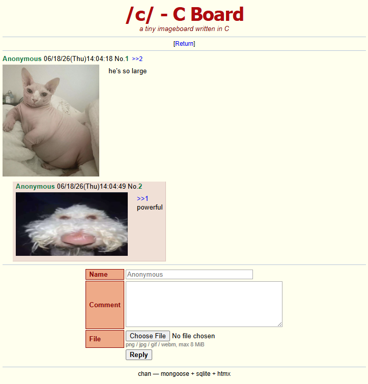

# chan

A minimal single-board imageboard (4chan-style textboard) written in C.

**Stack**
- [mongoose](https://github.com/cesanta/mongoose) — embedded HTTP server (vendored)
- [SQLite](https://sqlite.org) — storage, amalgamation build (vendored)
- [htmx](https://htmx.org) — frontend interactivity, no page reloads (vendored)
- a small single-header MD5 (`vendor/md5.h`) for the upload log

It's one board — no `/v/`, `/b/`, `/x/` routing. Just threads and replies.



## About

This was a fun project done in a couple of afternoons, mainly as an experiment with ai codegen
and to try htmx. I wanted something that was fully self contained so all of the C libs
I chose are single header/.c file pairs. Page renders use a stack based allocator instead of
malloc/free. Rate limits use a simple evict on collision cache. 

## LLM note

This entire thing was built with a (guided) llm (opus 4.8) in ~4 hours over two sessions. 
You can see the prompts used in plan.txt. For the first 10 plans, each instruction to the 
llm was just /goal read and execute the next part of the PLAN. For the remaining plans there
was some follow-up in the chat interface that's not recorded here. I tried to run a few rounds 
of simulated penetration testing with the llm (PLAN 7, PLAN8, PLAN10) but this code is likely
not very trustworthy for now. Claude's findings can be found in the security.md file.

## Build & run

```sh
make
./chan                      # listens on http://0.0.0.0:8000
./chan http://127.0.0.1:9000  # custom bind address
```

Then open the URL in a browser. State is stored in `chan.db` (created on first run).

Several limits are compile-time tunables: `BUMP_LIMIT` (300 posts), `THREAD_LIMIT`
(100 live threads), `DELETE_AFTER` (8h, seconds), `RATE_WINDOW` (5s between posts
per IP), `MAX_DISK_BYTES` (8 GiB upload quota), `MAX_UPLOAD` (8 MiB per file), and
the per-field size caps `MAX_NAME` / `MAX_SUBJECT` / `MAX_COMMENT`
(32 / 256 / 4096 bytes). Override them for testing, e.g.
`make clean && make CFLAGS="-O2 -DBUMP_LIMIT=4 -DDELETE_AFTER=3 -DRATE_WINDOW=0"`
(`make clean` first, since changing flags alone doesn't trigger a rebuild of the
cached objects).

## Features

- Start threads (name / subject / comment) and reply to them — fields are capped
  at 32 / 256 / 4096 bytes
- htmx-powered posting: new threads and replies appear without a full reload
- **Catalog-style index**: threads shown as a grid of thumbnail cells with
  reply counts; click a cell to open the thread
- **File uploads**: PNG / JPG / GIF / WEBM, up to 8 MiB. Type is validated by
  magic bytes (not the filename); images thumbnail and link to full size, webm
  plays inline
- **Click a post number** (`No.123`) in a thread to quote it — inserts `>>123`
  into the reply box and focuses it. Post numbers are green to signal they're
  clickable, and the post you jump to via a `>>123` link is highlighted
- **Reply backlinks**: each post shows links to the posts that reply to it
  (computed from `>>NN` quotes across the thread); clicking one jumps to that
  reply (unlike the post-number link, it doesn't quote into the reply box)
- **Bump limit**: after 300 posts a thread stops bumping, is marked red (in the
  catalog and on the thread page), and **rejects further replies** (it's full);
  8 hours later the thread and all its uploads are pruned automatically
- **Thread limit**: the board keeps at most 100 live threads — creating a new
  thread prunes the least-recently-bumped one (and its uploads) to bound the
  catalog
- Comments fill the width beside an uploaded image (media-object layout) rather
  than wrapping into a narrow column
- **Rate limiting**: at most one post per IP per `RATE_WINDOW` seconds (default 5),
  held in a fixed-size, direct-mapped in-memory cache. Each IP is reduced to a
  32-bit key (the full IPv4 address, or the `/64` prefix for IPv6) and mapped to a
  single slot via a splitmix64 mix; a collision just overwrites the slot
  (fail-open), so memory is constant regardless of how many IPs are seen.
  Over-limit posts get a message without losing the typed text. Behind a reverse
  proxy, set `CHAN_TRUSTED_PROXY=<proxy-ip>` to key off the left-most
  `X-Forwarded-For` entry — but only when the request actually arrives from that
  proxy address, so direct clients can't spoof their IP
- **Upload log** (`uploads.log`): one tab-separated line per upload recording
  time, IP, MD5, size, original filename, and stored path (untrusted fields are
  sanitized to defeat log/terminal-escape injection)
- **Disk quota / "OOM killer"**: when the upload directory exceeds a configurable
  size (default 8 GiB) whole threads are purged at random until back under it
- **Browser caching**: uploads are immutable (`uploads/<id>.<ext>`, never reused),
  so they're served `Cache-Control: immutable` for a year; static assets cache for
  an hour (Etag-revalidated after); dynamic HTML is `no-cache` so the catalog and
  threads never render stale
- Threads bump to the top of the catalog when they get a reply
- Greentext (`>like this`) and quote links (`>>123`)
- All user input is HTML-escaped server-side (XSS-safe). Responses carry
  security headers (`nosniff`, CSP, `X-Frame-Options`); uploads are served with a
  sandbox CSP so polyglot files can't execute as HTML. See `SECURITY.md`.

Uploads are written to `web/uploads/` and served as static files.

## Layout

```
src/main.c      application: routing, HTML rendering, SQL
vendor/         mongoose + sqlite amalgamation
web/            style.css, htmx.min.js (served as static assets)
Makefile
```

## Data model

A single `posts` table. A row with `thread_id IS NULL` is an opening post (a
thread); a row with `thread_id` set is a reply to that thread. Threads carry a
`bumped_at` used for index ordering.

On upload, the DB `image` reference is written **before** the file is written to
disk. This guarantees every file in `web/uploads/` is owned by a row, so a crash
mid-upload can only leave a dangling reference (a broken thumbnail cleaned up
when the thread is pruned) — never an orphan file.


